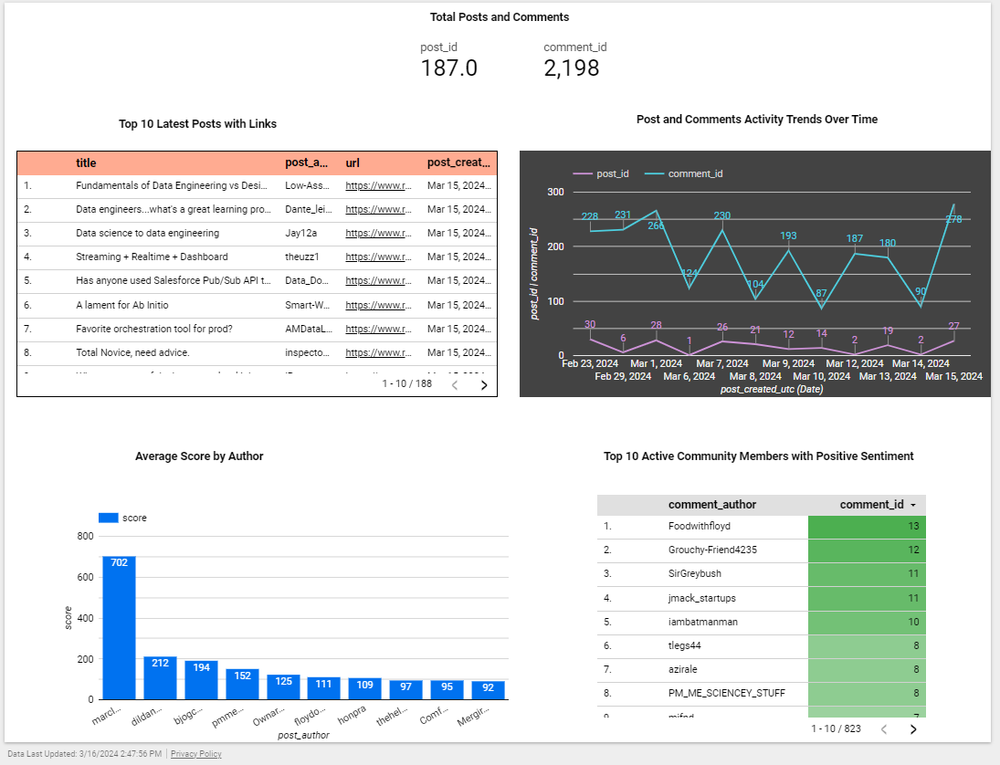

# de-reddit-reports

## Table of Contents
1. [About](#about)
2. [Features](#features)
3. [Project Structure](#project-structure)
4. [Project Content](#project-content)  
   - [Connect](#connect)
   - [Buffer](#buffer)
   - [Processing](#processing)
   - [Storage](#storage)
   - [Transformation](#transformation)
   - [Visualization](#visualization)
5. [Reports Dashboard](#reports-dashboard)
6. [VM Setup Guide](#vm-setup-guide)
7. [Project Setup Guide](#project-setup-guide)
8. [Project Execution Guide](#project-execution-guide)

## About  

<!-- 

  
  

    Powered by Mage-ai
  

 -->
  
The Data Engineering Reddit Data Dashboard offers a detailed overview of essential metrics sourced from the Data Engineering subreddit, covering posts and comments on a daily basis. It features an analysis of sentiments expressed in these posts, comments, and by the authors themselves, all tracked and evaluated on a daily basis.

## Features
1. The project is hosted on the Google Cloud Platform 
2. Mage-ai is used for the orchestration of the ETL pipeline 
3. Data manipulation is done through the Spark cluster(Google dataproc), where by increasing the worker node, the workload can be distributed across and finished faster if needed.
4. The data transformation phase involves conducting sentiment analysis on both comments and posts to assess the overall sentiment towards them. Additionally, a count verification is included when joining the post and comment datasets.
5. Utilizing CDC principles, the project employs DBT to implement an incremental model, ensuring that data updates for posts and comments are captured and merged accurately in BigQuery to prevent duplication of records in the consolidated dataset. 
6. For data visualization, the project utilizes Google Data Studio to create graphical representations.

## Project Structure

  

## Project Content   
  * ## Connect   
      The Mage load block, named **load_reddit_data**, serves as the bridge to connect to the data source, Reddit API. It facilitates the extraction of top posts and their corresponding comments from Reddit within the specified timeframe defined by the start and end dates.  
      The load block executes the python script `magic-de-reddit-reports/data_loaders/load_reddit_data.py` which orchestrates the extraction process. It is responsible for fetching the required data and ensuring its integrity.  
      The script contains test functions prefixed with test which validate the columns and their counts expected in the extracted posts and comments dataset.  
  
  * ## Buffer  
       The extracted datasets of posts and comments are stored in the Google Cloud Storage bucket named `reddit-terra-bucket`.
       For each run of the `load_reddit_data` block, the following data is deposited into the buffer bucket:
       * Post - This dataset encompasses post fields and is located at the path `reddit-terra-bucket/subreddit/dataengineering/post/yyyy/mm/d/post.parquet`  
       * Comment - This dataset encompasses comment fields and is located at the path  `reddit-terra-bucket/subreddit/dataengineering/comment/yyyy/mm/d/comment.parquet`
       * Metadata - A metadata dataset containing pertinent information such as pipeline run date, extraction start date, extraction end date, total posts, and total comments is stored at  `reddit-terra-bucket/subreddit/dataengineering/metadata/metadata.parquet`  

  * ## Processing  
       The processing is managed by the Mage block **reddit_data_transformer**, which involves two key scripts:    
       1. **load_metadata_from_gcs** -  This script fetches relevant metadata, specifically the *last extraction end date*, essential for the processing flow. It is located at `/magic-de-reddit-reports/data_exporters/load_metadata_from_gcs`.
       2. **export_reddit_data_from_gcs_to_bq** - This script utilizes Google's Dataproc to execute PySpark transformations. The script, located at `/magic-de-reddit-reports/data_exporters/export_reddit_data_from_gcs_to_bq.py`, relies on the *last extraction end date* obtained from the preceding step to streamline data extraction and transformation processes.  

       The script **export_reddit_data_from_gcs_to_bq** orchestrates a series of transformation steps applied to all posts and comments extracted during the daily operation. The steps include -   
       * UDF `analyze_sentiment_score` - Perform sentiment analysis based on posts and comments text and generate a sentiment score.
       * UDF `count_checksum_verification` - Perform count verification to verify the counts of post and comment datasets before and after joining, ensuring data integrity.
       * Addition of new columns to the datasets based on the calculated sentiment scores.
       * Perform time conversion from UTC to Timestamp.  

  * ## Storage  
       The output of the [Processing](#processing) step is stored in the Bigquery table `dataengineering_staging`.

  * ## Transformation  
       The DBT model located at `magic-de-reddit-reports/dbt/reddit_dbt/models/staging/reddit_data_consolidated.sql` employs the staging table within BigQuery, named `dataengineering_staging`, to integrate its data into the consolidated table, `reddit_data_consolidated`.  
       This DBT model guarantees the incremental insertion of data into the `reddit_data_consolidated` table while also updating existing records. It achieves this through the utilization of a merge strategy as the incremental approach. This ensures that the consolidated table remains up-to-date with the latest data, facilitating accurate and efficient data analysis and reporting processes.  
  
  * ## Visualization  
       Google Data Studio is utilized to create reporting dashboard.   
       It utilizes the BigQuery table `reddit_data_consolidated` as the data source.  
       More about Data Studio dashboard creation can be found [here](./project_execution_guide.md#dashboard-creation) 

        

## Reports Dashboard  
  

## VM Setup Guide
[Link to VM Setup Guide](./vm_setup.md)

## Project Setup Guide  
[Link to Project Setup Guide](./project_setup.md)

## Project Execution Guide  
[Link to Project Execution Guide](./project_execution_guide.md) 

