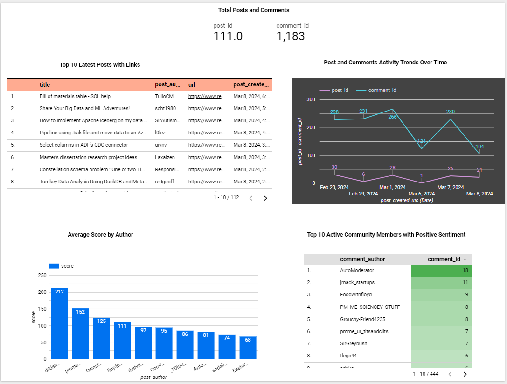

# de-reddit-reports

## Table of Contents
1. [About](#about)
2. [Features](#features)
3. [Project Structure](#project-structure)
4. [Reports Dashboard](#reports-dashboard)
4. [VM Setup Guide](#vm-setup-guide)
5. [Project Setup Guide](#project-setup-guide)
6. [Project Execution Guide](#project-execution-guide)

## About  

<!-- 

  
  

    Powered by Mage-ai
  

 -->
  
The Data Engineering Reddit Data Dashboard offers a detailed overview of essential metrics sourced from the Data Engineering subreddit, covering posts and comments on a daily basis. It features an analysis of sentiments expressed in these posts, comments, and by the authors themselves, all tracked and evaluated on a daily basis.

## Features
1. The project is hosted on the Google Cloud Platform 
2. Mage-ai is used for the orchestration of the ETL pipeline 
3. Data manipulation is done through the Spark cluster(Google dataproc), where by increasing the worker node, the workload can be distributed across and finished faster if needed.
4. The data transformation phase involves conducting sentiment analysis on both comments and posts to assess the overall sentiment towards them. Additionally, a count verification is included when joining the post and comment datasets.
5. Utilizing CDC principles, the project employs DBT to implement an incremental model, ensuring that data updates for posts and comments are captured and merged accurately in BigQuery to prevent duplication of records in the consolidated dataset. 
6. For data visualization, the project utilizes Google Data Studio to create graphical representations.

## Project Structure

  

## Reports Dashboard  
  

## VM Setup Guide
[Link to VM Setup Guide](./vm_setup.md)

## Project Setup Guide  
[Link to Project Setup Guide](./project_setup.md)

## Project Execution Guide  
[Link to Project Execution Guide](./project_execution_guide.md) 

