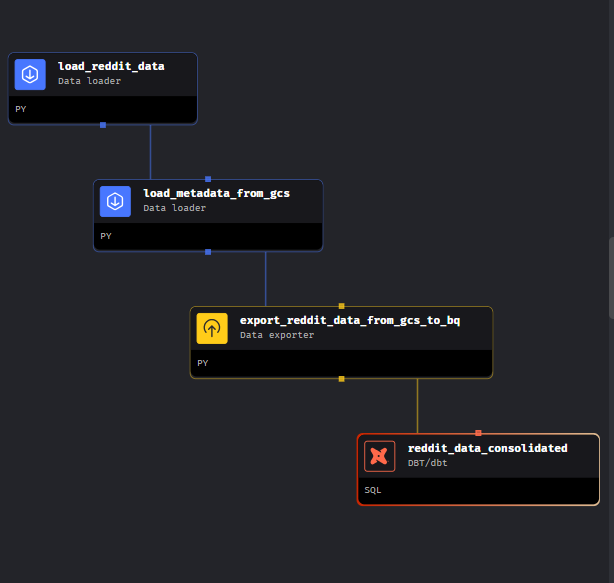
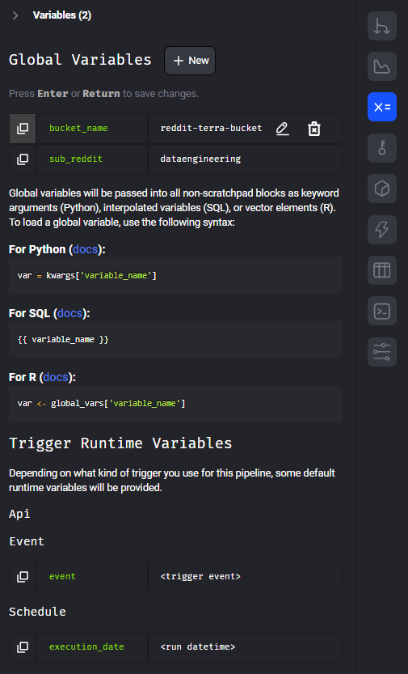
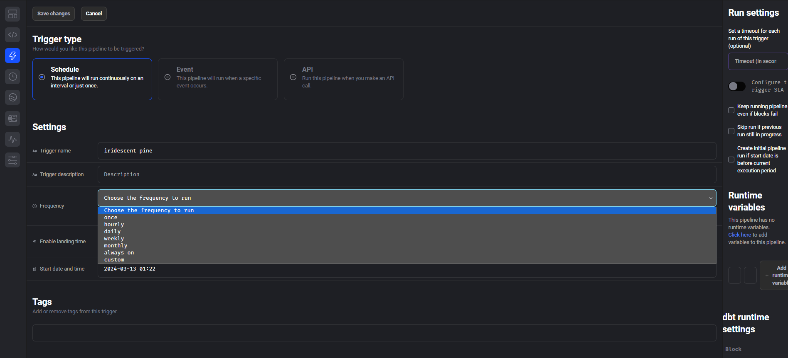
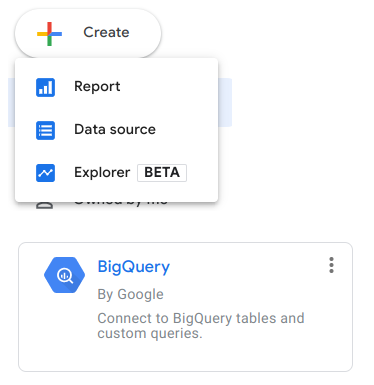
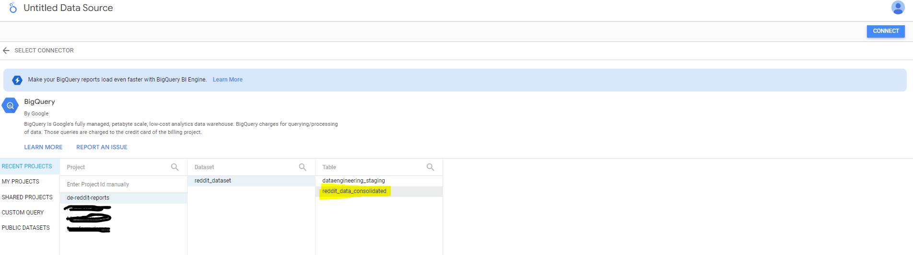
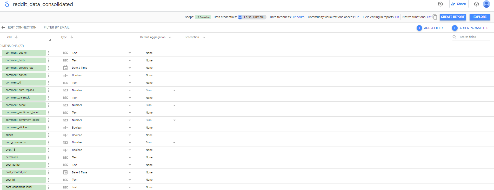

# de-reddit-reports 2024 Data Engineering Project Execution Steps

## Table of Contents
1. [Start Mage-ai Docker Container](#Start-Mage-ai-Docker-Container)
2. [Pipeline Creation and Execution](#pipeline-creation-and-execution)
3. [Dashboard Creation](#dashboard-creation)

## Start Mage-ai Docker Container  
1. If executing for the first time -  
   *  [Build Mage Image](./project_setup.md#build-mage-image)  
2. Run Mage Container from the project root directory (**./de-reddit-reports**) as done during Setup -  
   *  [Run Mage as Container](./project_setup.md#run-mage-as-container)
3. Go to the Mage Container running on port 6789 to access the Mage-ai GUI.  

## Pipeline Creation and Execution
1. Create a pipeline with the following blocks -  

2. Add two global variables to the pipeline, `bucket_name`, `sub_reddit`   

3. Execute the pipeline
4. A daily trigger can be added to the pipeline - 
  

## Dashboard Creation  
Dashboard creation is done via Google Data Studio  
1. Open [Google Data Studio](https://lookerstudio.google.com/u/0/)
2. create a BigQuery data source (it may be necessary to authorize Google Data Studio to access BigQuery), select reddit_data_consolidated table and click on connect.  
  
3. Connect to source by clicking the blue colored button named **CONNECT** on the top right end of the screen.
 
4.  in the next screen, we can see that the tool already suggests some aggregations for us. We set all of them to None, or custom select the fields for which to keep the "Sum" or "Count" aggregation.  
  
5. Click on the blue colored button named **CREATE REPORT** to add different reports like time-series, bar-chart, tables
