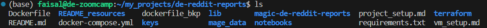
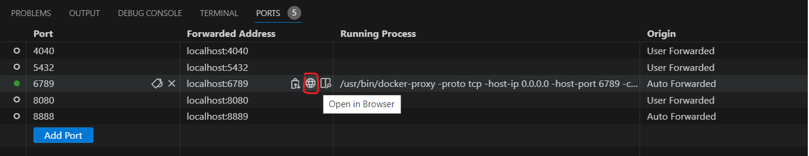
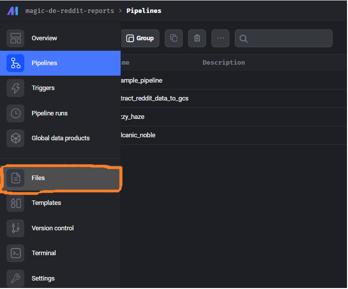
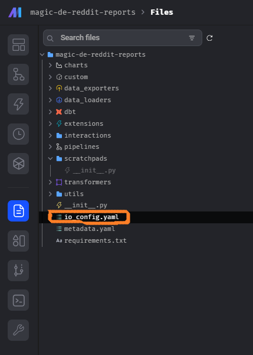

# de-reddit-reports 2024 Data Engineering Project Setup Guide

## Table of Contents
1. [Cloning the course repo](#cloning-the-course-repo)
2. [Add Service Account keyfile](#add-service-account-keyfile)
3. [Reddit developer account creation ](#reddit-developer-account-creation-and-configuration)
4. [Configure Reddit credentials](#configure-reddit-credentials)
5. [Configure Terraform](#configure-terraform)
6. [Terraform authentication and execution](#terraform-authentication-and-execution)
7. [Setup Mage-ai](#setup-mage-ai)
   - [Build Mage Image](#build-mage-image)
   - [Run Mage as Container](#run-mage-as-container)
   - [Configure io_config.yaml](#configure-io_configyaml)


## Cloning the course repo 
Clone the [course repo](https://github.com/FaisalQ07/de-reddit-reports.git) into the Virtual Machine. Your final folder structure should look something like this:  


## Add Service Account keyfile  
1. Create a folder `keys` under project `de-reddit-reports` as: `mkdir keys`
2. Add the JSON credentials keyfile created in the section [Creating a service account](./vm_setup.md/#creating-a-service-account) to keys folder
3. Make sure to add folder `keys` to the file `.gitignore`


## Reddit developer account creation
To extract Reddit data, one needs to utilize its Application Programming Interface (API). This entails following a series of steps to configure and set up access.  
1. Create a [Reddit account](https://www.reddit.com/register/).  
2. Navigate [here](https://www.reddit.com/prefs/apps) and create an app. Make sure you select "script" from the radio buttons during the setup process.
3. Take a note of a few things once this is setup:
    *  App name
    *  App ID
    *  API Secret Key


## Configure Reddit credentials  
1. Create a file `.env` under project folder `de-reddit-reports`
2. Add the following variables:  
    *  **PROJECT_NAME**=magic-de-reddit-reports
    *  **REDDIT_APP_NAME**=<*App name*> from [Reddit developer account creation](#reddit-developer-account-creation) step
    *  **REDDIT_APP_ID**=<*App ID*> from [Reddit developer account creation](#reddit-developer-account-creation) step
    *  **REDDIT_SECRET**=<*API Secret Key*> from [Reddit developer account creation](#reddit-developer-account-creation) step
3. As best practice, Mage-ai expects sensitive variables to be added to `.env` file. Mage-ai automatically adds .env to    gitignore. 
4. These variables become available in Mage-ai container volume to be accessed.  
   More about it in the section [Configure io_config.yaml](#configure-io_configyaml)


## Configure Terraform  
1. Open the file `variables.tf` under folder `terraform`
2. Edit the following variables. For simplicity, create project with the same name to avoid a lot of editing. You can change the region to the one closest to your geo-location for cost efficiency.  
    *  variable "project_id" -  Replace the default with `project_id` of your GCP project
    *  variable "region"     -  Replace the default with `region` of your chosing for GCS bucket creation
    *  variable "reddit_terra_dataset_id" - Replace the default with `dataset_id` of your chosing for BigQuery datset creation


## Terraform authentication and execution  
1. Create a variable `GOOGLE_CREDENTIALS` and make it point to the credentials keyfile path (covered in [Add Service Account keyfile](#add-service-account-keyfile))  
    ```bash
       export GOOGLE_CREDENTIALS='/home/user/keys/<credential-file>.json'
    ```
2. Terraform uses variable `GOOGLE_CREDENTIALS` to authenticate Terraform with GCP to manage resources.
3. Run the below commands in order to setup GCP infrastructure defined in `main.tf`  
    *  `terraform init`
    *  `terraform plan`
    * `terraform apply`
4. Login to GCP account and verify if the resources are created. It should create -   
    *  Google Storage Bucket - `reddit-terra-bucket`
    *  Google BigQuery Dataset - `reddit_dataset`


## Setup Mage-ai
Mage setup includes the following steps: 
### Build Mage Image  
1. Execute the below command from the project directory path containing `Dockerfile` to build the image named `mageai_with_gcloud_sdk`
   ```bash
      docker build -t mageai_with_gcloud_sdk .
   ```  

### Run Mage as Container  
1. Execute the below command to run the image `mageai_with_gcloud_sdk` as a container  
   ```bash
      docker-compose up
   ```
2. Forward port 6789 in your editor to be able to access Mage container.   
   If using VS Code  
    *  go-to `PORTS` tab in the terminal window.  
    *  Click on `Add Port`.  
    *  Under `Port`, type 6789 and it should automatically populate the next column named `Forwarded Address`.  
    * Click on the glob icon in red to access the Mage container in Browser.  
     

### Configure io_config.yaml
1. In the Mage GUI, click on the files icon on the left vertical pane.  
     
2. Select the file named io.config.yaml  
     
3. Under the section `# Google`:  
    *  Edit the value for variable`GOOGLE_SERVICE_ACC_KEY_FILEPATH`. Set it to: `/home/src/keys/<credential-file>.json`
4. At the end of the file, add the following:  
    ```bash
       # Reddit
       REDDIT_APP_NAME: "{{ env_var('REDDIT_APP_NAME') }}"
       REDDIT_APP_ID: "{{ env_var('REDDIT_APP_ID') }}"
       REDDIT_SECRET: "{{ env_var('REDDIT_SECRET') }}"
    ```
5. This makes reddit variables accessible in the Mage Code blocks.  
   For python, it can be accessed as:  
   ```bash
      import os
      os.getenv("REDDIT_APP_NAME")
   ```
