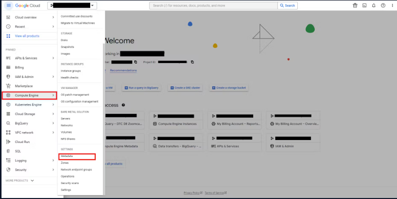
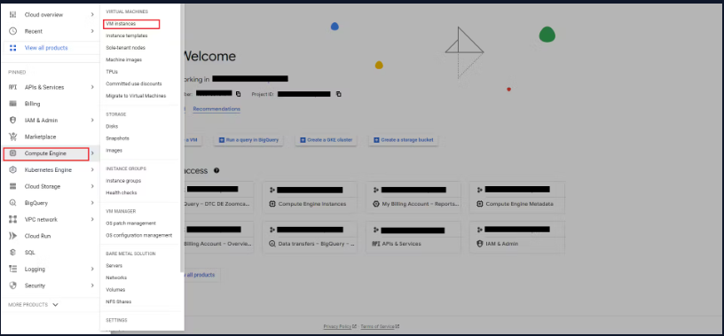
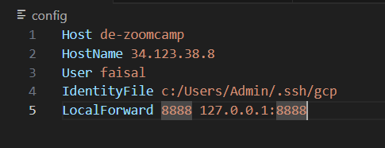
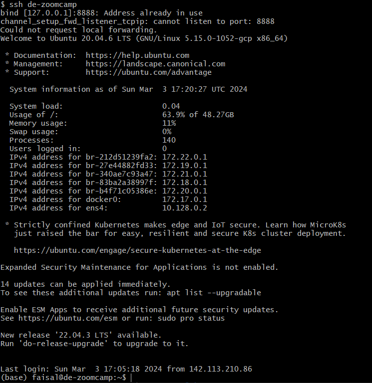
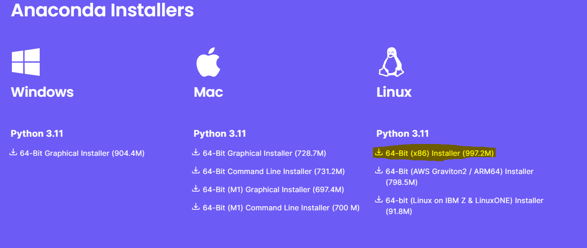
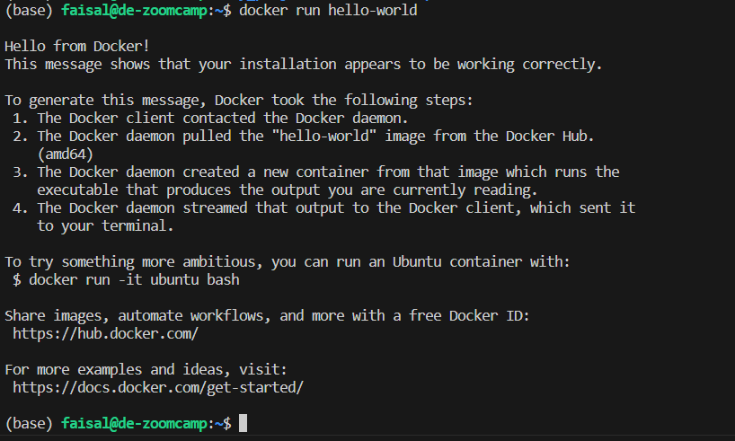
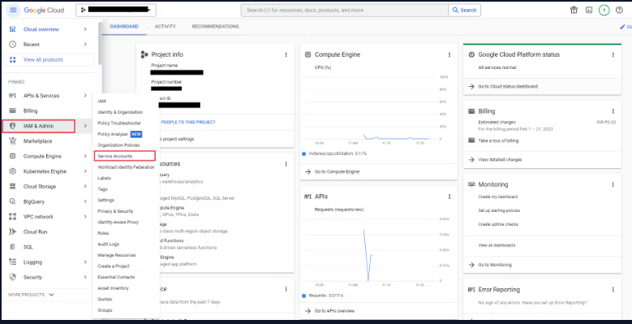
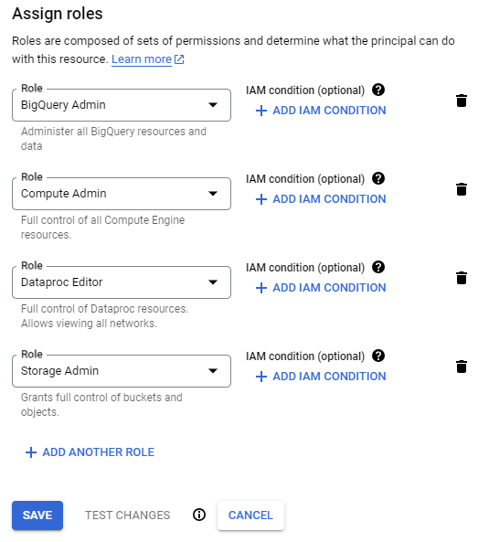

# de-reddit-reports 2024 Data Engineering Google VM Instance Setup Guide

## Table of Contents
1. [Configure SSH Keys](#configure-ssh-keys)
2. [Create a Virtual Machine](#create-a-virtual-machine)
3. [SSH: Aliasing Credentials with Config File](#ssh-aliasing-credentials-with-config-file)
4. [Configure the Virtual Machine](#configure-the-virtual-machine)
   - [Installing Anaconda](#installing-anaconda)
   - [Installing Docker](#installing-docker)
   - [Installing docker-compose](#installing-docker-compose)
   - [Installing Terraform](#installing-terraform)
   - [Creating a Service Account](#creating-a-service-account)
   - [Authenticate GCP using the service account credentials](#authenticate-gcp-using-the-service-account-credentials)
   - [Installing Pyspark](#installing-pyspark)
     - [Installing Java](#installing-java)
     - [Installing Spark](#installing-spark)
5. [Open a Remote Connection from Visual Studio Code](#open-a-remote-connection-from-visual-studio-code)
6. [Project Setup Guide](#project-setup-guide)
7. [Go back](#go-back)

## Configure SSH Keys
1. Generate a new SSH key with the following commands:
    ```bash
    cd ~/.ssh
    ssh-keygen -t rsa -f <key-file-name> -C <username> -b 2048
    ```
2. It'll raise a prompt to enter a passphrase. You can leave it and press enter. If it asks for confirmation, press enter again. Here's an example:  
  
3. This generates 2 files in the .ssh folder, one for the public (gcp.pub) and one for the private key (gcp).
4. Next, upload the public key to GCP with the following steps:
    * Open the gcp.pub file and copy its contents. Or you can use the cat command to display the contents in the terminal.
    * Go to the Google Cloud console > Compute Engine > Settings > Metadata.
      
    * Click on SSH Keys > Add SSH Keys  
      
    * Paste the contents of the public key that you copied previously on the text box and click Save.
5. Now, you can connect to your Google VMs using the following command:
    ```bash
    ssh -i <PATH_TO_PRIVATE_KEY> <USERNAME>@<EXTERNAL_IP>
    ```

## Create a Virtual Machine
To set up a Virtual Machine:  
1. Go to Compute Engine > VM Instances  
    
2. Click on Create Instance.  
    
3. Populate the configurations for the VM with the following details (Name and Region can be as per your preference):  
  *  Change name to <*preferred-name*>
  *  Select Region 
  *  Under Machine Config, select *series* - *E2* , *Machine type* - *e2-standard-4* 
  *  Under Boot Disk, select *Image type* - *Ubuntu 20.04 LTS*, *size* - *40 GB* 
  *  Leave the rest of the configurations to default values and click Create
4. This will spin up a virtual machine instance for you. In order to ssh into this instance, run the following command:   
    ```bash
       ssh -i <PATH_TO_PRIVATE_KEY> <USERNAME>@<EXTERNAL_IP>
    ```
    *  Here's an example on my system:  
       
5. You can also configure an ssh alias, which is a convenient way to store the ssh details in a config file.

## SSH: Aliasing Credentials with Config File
**Setting up Config file**
1. To set up an SSH alias, you first need to locate your SSH config file. This file is located in the .ssh directory in your home directory. The file is typically called config. If the file does not exist, you can create it.  
2. Once you have located the config file, open it in a text editor. You can use any text editor you like, such as nano or vim or VS Code. To create an alias, add the following lines to the file:  
  
3. The above credentials are to establish an SSH connection to a running Google Virtual Machine Instance. Here:  
  *  de-zoomcamp is the alias.
  *  34.123.38.8 is the external IP Address of the running VM instance.  
  *  faisal is the username.  
  *  c:/Users/Admin/.ssh/gcp is the path of the private key file.
  *  <*optional*> LocalForward - it forwards local port 8888 to the SSH server's local address (127.0.0.1) on port 8888.  

**Connecting to Virtual Machine**
1. Once you have created your alias, you can connect to the virtual machine by running the following command:
    ```bash
    ssh de-zoomcamp
    ```  
    * Here is the result:  
      

## Configure the Virtual Machine
### Installing Anaconda  
1. Visit [Anaconda's website](https://www.anaconda.com/download) and copy the link to Linux 64-Bit Installer  
     
2. Download the file in the VM:  
   ```bash
       wget https://repo.anaconda.com/archive/Anaconda3-2023.09-0-Linux-x86_64.sh
   ```  
3. Run the downloaded file:  
   ```bash
      bash  Anaconda3-2023.09-0-Linux-x86_64.sh
   ```  
4. Keep pressing Enter to scroll down and enter yes to accept the license terms.
5. Press Enter to confirm the default location.
6. Enter yes to run the conda init when asked.
7. To automatically activate the Conda base environment upon logging into your VM:    
    *  do *__vim ~/.bashrc__*  
    *  Go to the end of the file and press 'i' to activate insert mode  
    *  Paste to the end, `eval "$(/path/to/your/anaconda3/bin/conda shell.bash hook)"`
    *  Press __Esc__ to exit insert mode, then type `:wq` to save and exit __vim__ editor
    *  type logout
    *  Type `ssh de-zoomcamp` to login back into the VM, and it will show `(base)` representing conda activation  
    * Here is the result:  
      


### Installing Docker  
1. Run the following commands:  
   ```bash
     sudo apt-get update
     sudo apt-get upgrade
     sudo apt-get install docker.io 
   ```  
2. This will install docker but you'll not be able to run it without sudo. It'll throw a permission denied error when trying to run a container as `docker run hello-world`  
  *  Error:  
     
3. To run docker without sudo, run the following commands:  
   ```bash
      sudo groupadd docker
      sudo gpasswd -a $USER docker
      sudo service docker restart
   ```  
4. Log out of the ssh session and log back in to re-evaluate the group memberships and try running the docker run hello-world command.  
   It works now, without using sudo  
   


### Installing docker-compose  
1. go to [Docker Compose Releases](https://github.com/docker/compose/releases/tag/v2.24.1).  
   Copy the link to the latest [release](https://github.com/docker/compose/releases/download/v2.24.1/docker-compose-linux-x86_64)  
2. Create a new bin folder in VM and download the asset into it:  
   ```bash
      cd ~
      mkdir bin
      cd bin
      wget https://github.com/docker/compose/releases/download/v2.24.1/docker-compose-linux-x86_64 -O docker-compose
   ```  
3. This will create a new file docker-compose in the bin folder.
4. Make this file executable:  
   `chmod +x docker-compose`  
5. Next, add the bin folder to the path:  
    *  Go to the home directory: `cd ~`  
    *  Open the .bashrc file: `nano .bashrc`  
    *  Paste the following to the end of the `.bashrc` file:
       `export PATH="${HOME}/bin:${PATH}"`  
    * Press `Ctrl+O` > `enter` > `Ctrl+X`  
6. docker-compose installed successfully.  
     


### Installing Terraform  
1. From terraform's [installation website](https://developer.hashicorp.com/terraform/install), Copy the link for Linux's AMD64 file.
2. Go to the bin folder created previously and download the file using `wget`:  
   ```bash
      cd ~/bin
      wget https://releases.hashicorp.com/terraform/1.7.4/terraform_1.7.4_linux_amd64.zip
   ```  
3. To unzip this file, install the unzip package: `sudo apt-get install unzip`  
4. Unzip the file: `unzip terraform_1.7.4_linux_amd64.zip`  
5. There will be a terraform executable file extracted. You can delete the zip file.
6. Since this file is in the bin folder and the bin folder is in the path, everything is set up.
7. Try running the following command to verify terraform's installation: `terraform --version`  
     


### Creating a service account  
1. In your GCP project, go to IAM and Admin > Service Accounts  
   
2. Click on the "Create Service Account" button at the top and provide the service account name.  
3. Assign the following roles to this service account:  
     
4. Click Save. The service account is now created.
5. To generate keys for this service account, click on the 3-dot menu and then on "manage keys"  
     
6. On the following page, click on Add Key > Create new key> JSON format. Click Create.
7. This will download a JSON file. This is to be uploaded to the VM using SFTP (or just drag and drop via VS Code).
8. Next, create a folder in *home dir* `.gcp` and upload the JSON credentials file into it  


### Authenticate GCP using the service account credentials  
1. To authenticate GCP, we need to set an environment variable  
    *  `$GOOGLE_APPLICATION_CREDENTIALS` to point to the service account JSON file:  
       ```bash
          export GOOGLE_APPLICATION_CREDENTIALS=/home/faisal/.gcp/<credentials-filename>.json
       ```  
2. Next, authenticate GCP using the following command:  
   ```bash
      gcloud auth activate-service-account --key-file $GOOGLE_APPLICATION_CREDENTIALS
   ```


### Installing Pyspark  
Pyspark installation requires Java and Spark installation.  
Below steps can be followed for their installation -   
### Installing Java   
1. Download OpenJDK 11 or Oracle JDK 11 (It's important that the version is 11 - spark requires 8 or 11)
2. We'll use OpenJDK. 
   Download it to `~/spark` as:  
   ```bash
      wget https://download.java.net/java/GA/jdk11/9/GPL/openjdk-11.0.2_linux-x64_bin.tar.gz
   ```  
3. Unpack it:  
   ```bash
      tar xzfv openjdk-11.0.2_linux-x64_bin.tar.gz
   ```  
4. define `JAVA_HOME` and add it to `PATH`:  
   ```bash
      export JAVA_HOME="${HOME}/spark/jdk-11.0.2"
      export PATH="${JAVA_HOME}/bin:${PATH}"
   ```
5. check that it works using command: `java --version`  
   
6. Remove the archive: 
   ```bash
      rm openjdk-11.0.2_linux-x64_bin.tar.gz
   ```  

### Installing Spark  
1. Download Spark. Use 3.5.0 (or 3.5.*) version  to `~/spark` as:  
   ```bash
      wget https://dlcdn.apache.org/spark/spark-3.5.1/spark-3.5.1-bin-hadoop3.tgz
   ```  
2. Unpack:  `tar xzfv spark-3.5.1-bin-hadoop3.tgz`  
3. Remove the archive: `rm spark-3.5.1-bin-hadoop3.tgz`  
4. Add it to `PATH`:  
   ```bash
      export SPARK_HOME="${HOME}/spark/spark-3.5.1-bin-hadoop3"
      export PATH="${SPARK_HOME}/bin:${PATH}"
   ```  
5. Testing Spark. Execute `spark-shell` and run the following:  
   ```bash
      spark-shell
      val data = 1 to 10000
      val distData = sc.parallelize(data)
      distData.filter(_ < 10).collect()
   ```

**Pyspark**  
1. Pyspark requires python to be already installed. This is covered in the section [Installing Anaconda](#installing-anaconda).
2. To run PySpark, we first need to add it to PYTHONPATH:  
   ```bash
      export PYTHONPATH="${SPARK_HOME}/python/:$PYTHONPATH"
      export PYTHONPATH="${SPARK_HOME}/python/lib/py4j-0.10.9.7-src.zip:$PYTHONPATH"
   ```  
3. Make sure that the version under `${SPARK_HOME}/python/lib/` matches the filename of py4j or you will encounter `ModuleNotFoundError: No module named 'py4j'` while executing import pyspark.  


### Open a Remote Connection from Visual Studio Code  
1. Install the "Remote-SSH" extension.  
     
2. Press F1 and select "Remote SSH: Connect to Host". It will show you the hosts configured on your system.
3. Select the one associated with your Virtual Machine. *`de-zoomcamp`* in my case
   

## Project Setup Guide  
[Link to Project Setup Guide](./project_setup.md)


## Go back   
[Link to go back](./README.md)


  

  


